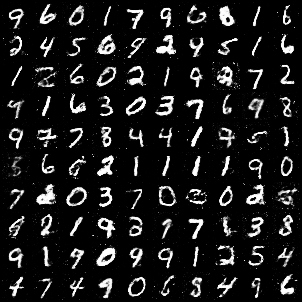

# Generative Adversarial Networks

> Generative Adversarial Networks  [[Paper Link](https://papers.nips.cc/paper/5423-generative-adversarial-nets.pdf)]

**Pytorch implementation of Generative Adversarial Networks**

## Result
